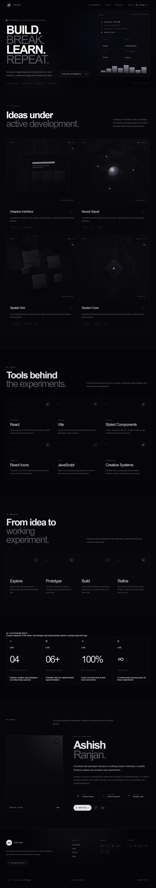

# Test App

Test App is a React and Vite playground for interface studies, prototypes, creative coding and modern frontend concepts. It presents experiments, the tools behind them and a short process for shaping ideas into usable interfaces.

## Features

- Responsive fixed header with mobile navigation
- Interface studies with local visual assets
- Stack, process, metrics and creator sections
- Icon-only social and support links in the footer
- GitHub Pages deployment

## Tech stack

React, Vite, styled-components, React Icons and JavaScript.

## Run locally

    git clone https://github.com/a2rp/test-app.git
    cd test-app
    npm install
    npm run dev

## Deployment

Live: [https://a2rp.github.io/test-app/](https://a2rp.github.io/test-app/)

Deploy with:

    npm run deploy

## Future possibilities

The playground can grow with more focused interface studies, reusable components and small accessibility or performance experiments.

## Links

- Portfolio: [https://www.ashishranjan.net/](https://www.ashishranjan.net/)
- GitHub: [https://github.com/a2rp](https://github.com/a2rp)
- CodePen: [https://codepen.io/ash1198](https://codepen.io/ash1198)
- LinkedIn: [https://www.linkedin.com/in/aashishranjan](https://www.linkedin.com/in/aashishranjan)
- Facebook: [https://www.facebook.com/theash.ashish/](https://www.facebook.com/theash.ashish/)
- YouTube: [https://www.youtube.com/@ashishranjan-ashz?sub_confirmation=1](https://www.youtube.com/@ashishranjan-ashz?sub_confirmation=1)
- Email: [ash.ranjan09@gmail.com](mailto:ash.ranjan09@gmail.com)

## Support

- Support: [https://a2rp-donation-page.netlify.app/](https://a2rp-donation-page.netlify.app/)
- Buy Me a Coffee: [https://buymeacoffee.com/a2rp](https://buymeacoffee.com/a2rp)
- Patreon: [https://www.patreon.com/a2rp](https://www.patreon.com/a2rp)
