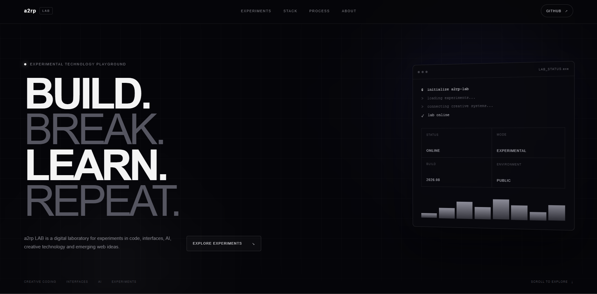

# test-app

An experimental frontend playground for creative coding, modern interfaces, AI concepts, and web experiments.

## Preview



## Features

- Modern responsive interface
- Experimental UI concepts
- React Icons integration
- Picsum-based visual elements
- Interactive experiment cards
- Process and stack sections
- Creator profile section
- Social and support links
- Responsive layout
- GitHub Pages deployment

## Tech Stack

- React
- Vite
- Styled Components
- React Icons
- JavaScript

## Run Locally

```bash
npm install
npm run dev
```

## Build

```bash
npm run build
```

## Deploy

```bash
npm run deploy
```

## Author

**Ashish Ranjan**

- Portfolio: https://www.ashishranjan.net
- GitHub: https://github.com/a2rp
- CodePen: https://codepen.io/ash1198
- LinkedIn: https://www.linkedin.com/in/aashishranjan
- Facebook: https://www.facebook.com/theash.ashish/
- YouTube: https://www.youtube.com/@ashishranjan-ashz?sub_confirmation=1
- Email: mailto:ash.ranjan09@gmail.com

## Support

- Support: https://a2rp-donation-page.netlify.app/
- Buy Me A Coffee: https://buymeacoffee.com/a2rp
- Patreon: https://patreon.com/a2rp

## License

MIT License
